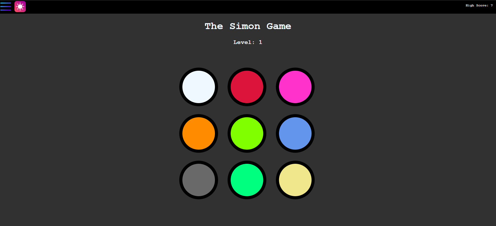
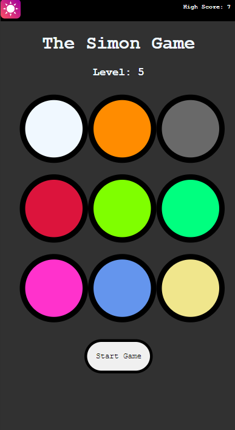

# **_Simon Game_**

## **_Game Description:_**

A Simon game with 9 circles is an extension of the classic Simon game, which traditionally uses 4 colored buttons.The player must repeat increasingly complex sequences of lights and sounds.

## **Technologies used :**

- HTML
- CSS
- JavaScript

## Getting Started

- The game starts with a single circle lighting up and playing its associated sound.the player press the lighted circle .then The game adds another circle to the sequence, The player must repeat the sequence by clicking on the circles in the correct order.

* planning.md file was used to keep track of development progress and can be viewed [here](https://github.com/VinsintQ/simon-game/blob/main/planning.md)

- The project itself was deployed and can be viewed [here](https://vinsintq.github.io/simon-game/) .

### **_some images from the game :_**

### **_Future Updates_**

- [x] DarkMode and LightMode
- [ ] adding Hard level (all circles have the same color and sound)

---

### credits

- sounds [pixaby](https://pixabay.com/sound-effects/search/short/)

* icons [flaticon](https://www.flaticon.com/free-icons/menu)
